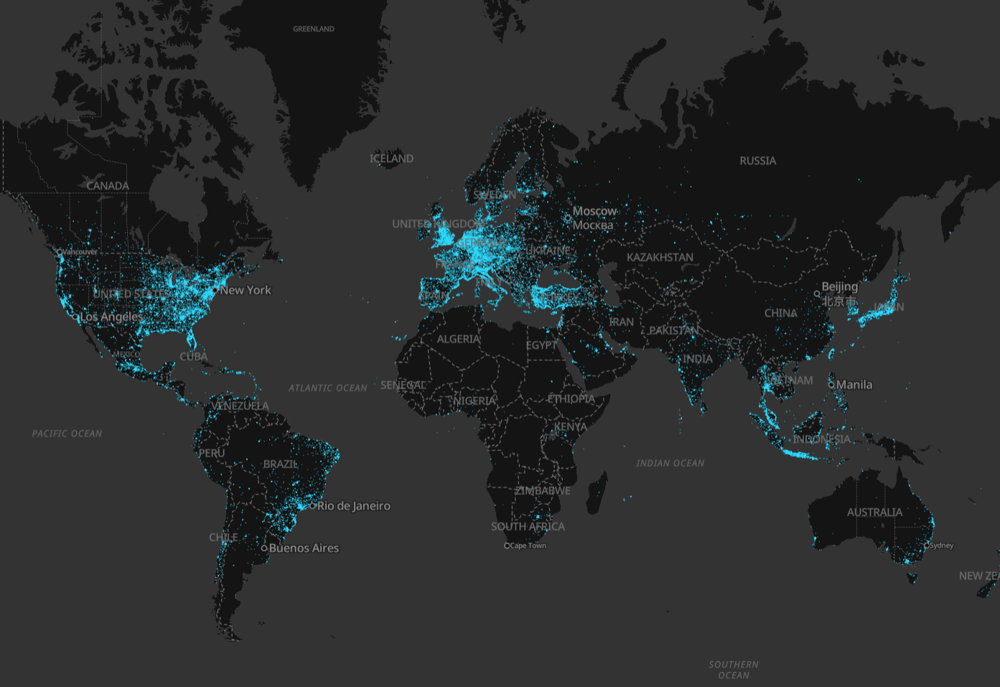

# foursquare-os-places-pmtiles
All 100M+ open source places of Foursquare in a single PMTiles file

Read the [Foursquare blog post...](https://location.foursquare.com/resources/blog/products/foursquare-open-source-places-a-new-foundational-dataset-for-the-geospatial-community/)

## Demo

https://wipfli.github.io/foursquare-os-places-pmtiles

## Download

[foursquare-os-places-2024-11-20.pmtiles](https://oliverwipfli.ch/data/foursquare-os-places-2024-11-20.pmtiles) (22 GB)

## Steps

Install DuckDB and Tippecanoe.

Run `./run.sh`. This calls duckdb and gets all the rows, structures them into geojson, and feeds them to Tippecanoe.

## Acknowledgements

Inspired by @bdon's [Overture places script](https://github.com/OvertureMaps/overture-tiles/blob/main/scripts/2024-04-16-beta/places.sh). Uses @msbarry's [Overture html viewer](https://github.com/msbarry/planetiler-overture-demo/blob/main/index.html).

